### 1.打开cmd，切换到需要存放plugin的文件夹
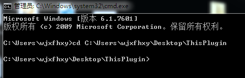

### 2.拖放gradle.bat，并输入“ init”，回车
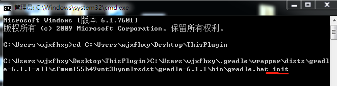

### 3.一路按提示操作
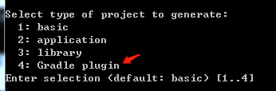

选择你熟悉的语言

这里是开发plugin的语言，不熟悉Groovy，可以选择Java或kotlin

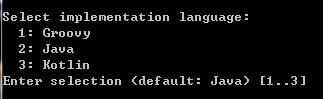

这里是配置build.gradle的语言，建议选择Groovy

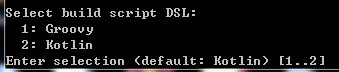

工程名字，默认是文件夹名

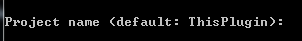

包名，默认是文件夹名

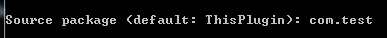

完成了

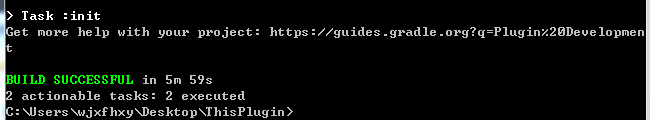


### 4.用AS打开工程，找到implementationClass中的apply方法，可以开始你的表演了
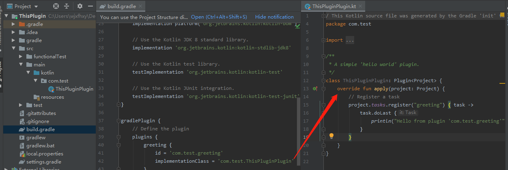

### 5.增加uploadArchives，打包输出到本地
```
uploadArchives {
    repositories.mavenDeployer{
        // 配置本地仓库路径，项目根目录下的repository目录中
        repository(url: uri('/repo'))
        pom.groupId = "com.test.ThisPluginPlugin"// 唯一标识（通常为模块包名，也可以任意）
        pom.artifactId = "TestPlugin" // 项目名称（通常为类库模块名称，也可以任意）
        pom.version = "1.0.0"      // 版本号
    }
}
```
最终输出路径如uploadArchives所配置

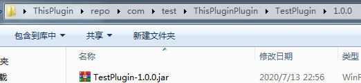

### 6.新建一个工程，把plugin集成进去

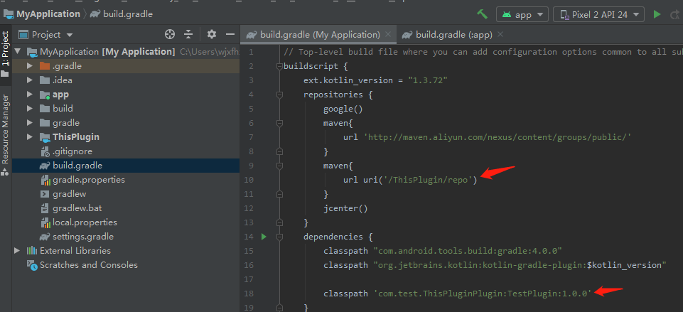


### 7.进行调试plugin设置

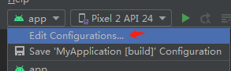

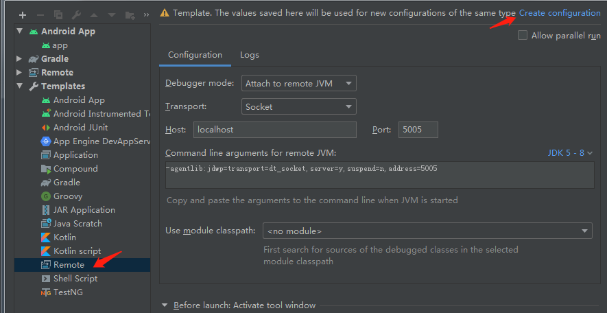

把“Unnamed”改为你喜欢的名字，不改也行

记下“-agentlib:jdwp=transport=dt_socket,server=y,suspend=n,address=5005”

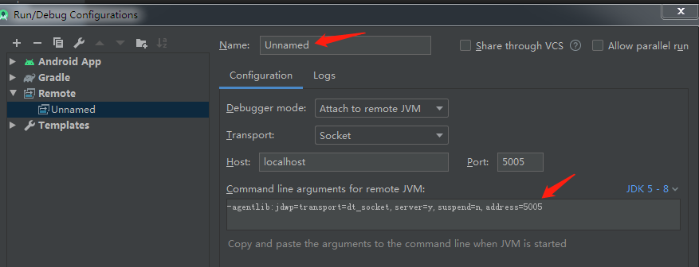

展开侧栏Gradle对build进行修改

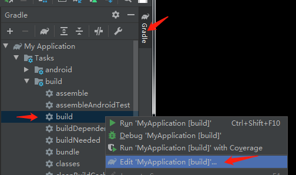

把刚才记下那段东西粘进来，并把“suspend=n”改为“suspend=y”

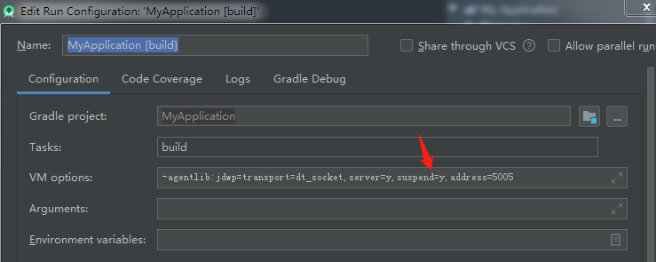

sync project with gradle files后，你会看到这个，双击运行

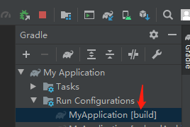

看到这样的状态，快接近成功了

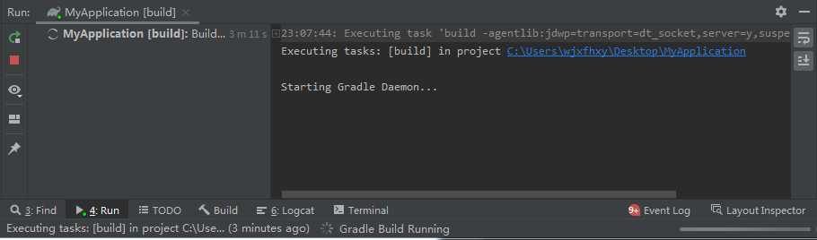

选择“Unnamed”，然后Debug

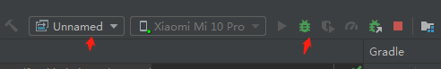

等一会………………………………………………………………………………………………

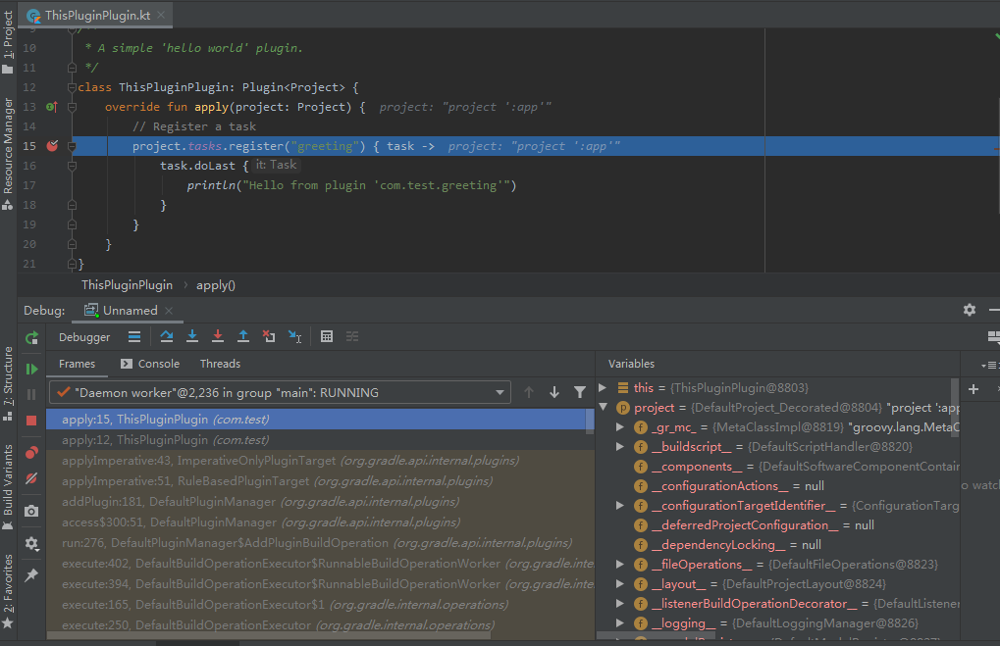

恭喜你，成功了！

如果不行，关闭AS，重新Run Configurations和Debug Unnamed

如果plugin中含有Transform的子类，且无法对其进行断点Debug的话，先clean工程